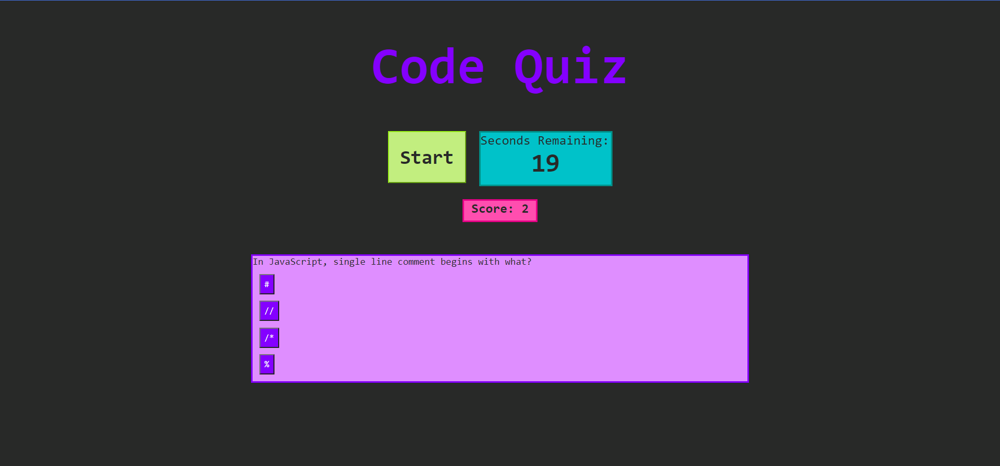

# Code Quiz

---

Title: Code Quiz
Developer: Robyn Arnecke
Deployment Date: 01/09/2022
Published: https://ribbonanarchy.github.io/04-Unit4-HW-Code-Quiz/

---

# Summary

Code Quiz is a page that administers questions about Javascript. 

Once the start button is clicked, the 30 second timer starts and the user is presented with a series of questions. 

The application keeps track of the score, which is one point for each question answered correctly plus the time left on the clock when the user has finished the last question. When the user selects and incorrect answer, they are docked 5 seconds on the clock. 

The application does not currently store the user's initials and score for a scoreboard, though that functionality may be added later. 

--- 

# Development

I started out development focusing on the format and how I wanted the quiz to look. Once I had the initial homescreen down and the CSS rough draft, I started in on the Javascript for functionality. 

First hurdle was getting the start button to both start the timer and present the first question. I considered putting the questions as different card elements in the HTML and then toggling the hide display property. Instead I decided on dynamically adding and changing the properties of the question card within the Javascript.

Each answer to the questions is a button, and I used event delegation to listen for the user's click of one of the buttons. The function triggered by the event listener would update the score if the user was right, detract from the timer if the user was wrong, and then repopulate the question card with the next question/answer set.

If the user answers all of the questions before the time runs out, the timer is set to 0, and the function that ends the quiz and prompts the user for their initials is triggered. 